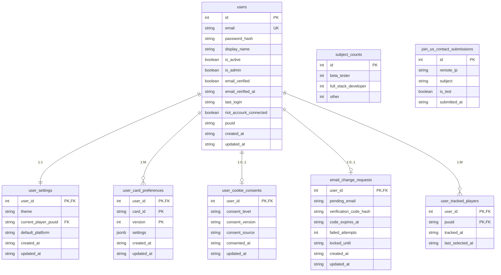
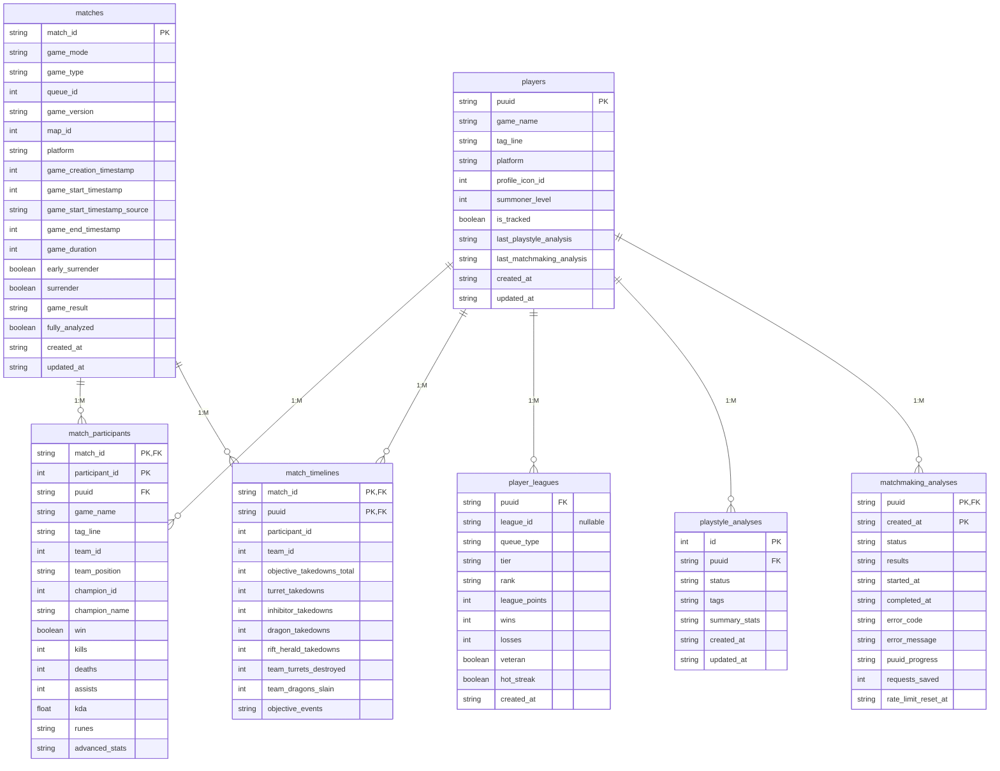
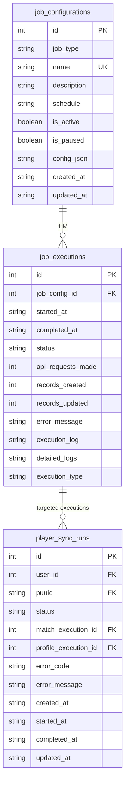

# Database Schema

> **Authority:** Maintained explanation of the PostgreSQL model and safe schema
> change workflow. Ordered Alembic revisions in
> [`../backend/alembic/versions/`](../backend/alembic/versions/) are the
> executable schema source of truth.
>
> **Maintenance:** Update this document with every schema or SQLAlchemy model
> change.

**Database**: PostgreSQL 18
**ORM**: SQLAlchemy 2.0+
**Schemas**: `auth`, `core`, `jobs`

---

## Entity Relationships

### Auth Schema



### Core Schema



### Jobs Schema



---

## Enum Types

### `core.matchmaking_analyses.status`

This lifecycle uses a checked string column rather than a PostgreSQL enum so an
incremental migration can safely classify legacy rows.

- `pending` - accepted and queued for the process-local background worker
- `in_progress` - actively calculating or fetching data
- `waiting_rate_limit` - still active, waiting until `rate_limit_reset_at`
- `completed` - terminal success with immutable result data
- `failed` - terminal failure with a stable safe error code/message
- `cancelled` - terminal user or process interruption

The partial unique index `uq_matchmaking_analyses_active_puuid` covers the
three active states and prevents concurrent analyses for the same PUUID.

### `jobs.job_status_enum`

- `PENDING` - Job queued
- `RUNNING` - Currently executing
- `PAUSED` - Waiting at a runtime control checkpoint
- `SUCCESS` - Completed successfully
- `FAILED` - Error occurred
- `CANCELLED` - Stopped or interrupted
- `RATE_LIMITED` - Stopped due to API rate limits

### `jobs.job_type_enum`

- `MATCH_FETCHER` - Fetches new matches
- `PLAYER_UPDATER` - Updates tracked player profile data

### `jobs.execution_type_enum`

- `REGULAR` - Scheduled or manually triggered data-writing run
- `TEST` - API exercise run that does not write gameplay data

### `core.analysis_status_enum`

- `PENDING` - Analysis queued
- `IN_PROGRESS` - Currently running
- `COMPLETED` - Finished successfully
- `FAILED` - Error occurred
- `CANCELLED` - User cancelled

### `auth.theme_enum`

- `LIGHT`
- `DARK`

### `auth.cookie_consent_level_enum`

- `necessary`
- `all`

---

## Key Tables

### `auth.users`

User authentication and authorization.

| Column                  | Type         | Description                                       |
| ----------------------- | ------------ | ------------------------------------------------- |
| `id`                    | bigint       | Primary key                                       |
| `email`                 | varchar(255) | Unique email                                      |
| `password_hash`         | text         | Argon2id password hash                            |
| `display_name`          | varchar(128) | User display name                                 |
| `is_active`             | boolean      | Account enabled                                   |
| `is_admin`              | boolean      | Admin privileges                                  |
| `failed_login_attempts` | int          | Consecutive failed login attempts                 |
| `last_failed_login`     | timestamptz  | Latest failed login timestamp                     |
| `locked_until`          | timestamptz  | Temporary lock expiration after too many failures |
| `puuid`                 | varchar(78)  | Linked Riot account (optional)                    |

**Trigger**: `trg_create_user_settings_after_user_insert` automatically creates `user_settings` record.

`current_player_puuid` is the per-account default for new player-centric
navigation. Explicit `?puuid=` page state remains authoritative within an open
tab. Revision `20260809_0006` backfills this value from a valid legacy viewed
player or linked Riot account and removes the obsolete per-page save-search
columns.

### `auth.user_card_preferences`

Version-coexistent viewer-owned overrides for the approved analytical-card
catalog. A preference never includes a PUUID, Riot ID, match data, or another
user's identifier.

| Column       | Type        | Description                                                     |
| ------------ | ----------- | --------------------------------------------------------------- |
| `user_id`    | bigint      | PK + FK to `auth.users.id`; authenticated viewer owner          |
| `card_id`    | varchar(64) | PK; stable approved card identifier                             |
| `version`    | int         | PK; positive card-settings contract version                     |
| `settings`   | jsonb       | Validated mutable fields only; defaults are added on API reads  |
| `created_at` | timestamptz | When this versioned override was first stored                   |
| `updated_at` | timestamptz | When this versioned override was last atomically replaced       |

**Primary Key**: (`user_id`, `card_id`, `version`). The composite key permits
a future-version row to coexist with v1. LGA-24 reads and changes only the
supported v1 row, so reset and upsert cannot discard a later compatible
server's settings. The `version > 0` database check complements the API's
card-specific validation.

### `auth.refresh_tokens`

Rotating refresh-token session store.

| Column       | Type        | Description                          |
| ------------ | ----------- | ------------------------------------ |
| `id`         | bigint      | Primary key                          |
| `user_id`    | bigint      | FK to `auth.users.id`                |
| `token_id`   | varchar(36) | Refresh token identifier             |
| `token_hash` | text        | SHA-256 hash of raw refresh token    |
| `expires_at` | timestamptz | Expiration time                      |
| `revoked_at` | timestamptz | Revocation time (`NULL` when active) |

### `auth.revoked_access_tokens`

Blacklist for JWT access token revocation by `jti`.

| Column       | Type        | Description                              |
| ------------ | ----------- | ---------------------------------------- |
| `id`         | bigint      | Primary key                              |
| `user_id`    | bigint      | FK to `auth.users.id`                    |
| `token_id`   | varchar(36) | Revoked JWT `jti` claim                  |
| `revoked_at` | timestamptz | When token was revoked                   |
| `expires_at` | timestamptz | Original token expiration                |
| `reason`     | varchar(64) | Revocation reason (`logout`, `security`) |

### `auth.user_tracked_players`

User-specific tracked player mappings.

| Column       | Type        | Description                            |
| ------------ | ----------- | -------------------------------------- |
| `user_id`    | bigint      | FK to `auth.users.id`                  |
| `puuid`      | varchar(78) | FK to `core.players.puuid`             |
| `tracked_at` | timestamptz | When the player was added to this user |
| `last_selected_at` | timestamptz | Recent-selection ordering for the sidebar |

**Primary Key**: (`user_id`, `puuid`)
**Behavior**: Jobs process players tracked by any user (distinct `puuid` set).

### Local Riot-data cleanup and QA fixtures

`backend/scripts/cleanse_local_riot_data.py` is the only reviewed maintenance
command for LGA-11's local data reset. It deletes the reviewed Riot-derived
tables in foreign-key-safe order, clears Riot links from user accounts, and
preserves application configuration, user settings, job configuration, and job
execution history. It resets the documented local-only admin fixture and
creates or normalizes the documented non-admin client fixture.

The command is read-only by default. It refuses to run unless all of these are
true: `ENVIRONMENT=dev` is explicit, `POSTGRES_HOST`, every PostgreSQL
`listen_addresses` bind, and the active listener are loopback-only,
`--database` exactly matches `POSTGRES_DB`, and the reviewed application tables
exist. The configured environment, host, and database name are checked before a
database session opens. Applying changes also requires a new canonical backup
path outside the repository whose parent is not writable by group or other
accounts and whose non-sticky directory ancestors are not writable by group or
other accounts. The command blocks writers to every table it will change before
creating the custom-format `pg_dump`, keeps those locks through the cleanup
transaction, and creates a new owner-only `0600` archive with no-follow
semantics before `pg_dump` receives any database data. The command re-verifies
the archive's descriptor identity and permissions before
`pg_restore --list`; if the filesystem cannot honor them, it securely removes
only that verified file and refuses before any database mutation. It also
clears all saved Riot PUUID URL preferences while preserving settings rows and
revoked access-token blacklist entries.

Before an apply, the command locks the two writer job tables, refuses if a
regular Match Fetcher or Player Updater execution is `RUNNING` or `PAUSED`,
requires exactly one Match Fetcher and one Player Updater configuration to
receive the interlock, and persists a `riot_maintenance_mode` interlock on them.
Regular scheduled writers record a
`CANCELLED` execution before a Riot-data write. Direct account linking, player
tracking/refresh, match-history storage, and matchmaking analysis acquire
gameplay and job-table locks in cleanup order, then re-read the interlock before
a core/auth write or Riot-data request. The interlock stays enabled after cleanup
so the emptied database cannot be immediately repopulated. Do not clear it with the jobs API;
resume only through the separately guarded command after local maintenance is
complete.

```bash
cd backend
uv run python scripts/cleanse_local_riot_data.py \
  --database league_analysis_local_dev

install -d -m 700 "$HOME/.local/state/league-analysis/backups"
uv run python scripts/cleanse_local_riot_data.py \
  --database league_analysis_local_dev \
  --apply \
  --backup-path "$HOME/.local/state/league-analysis/backups/pre-lga-11.dump"

uv run python scripts/cleanse_local_riot_data.py \
  --database league_analysis_local_dev \
  --resume-writers
```

Never point this command at production, a shared environment, a remote host,
or a database whose identity cannot be proven. Restore the verified backup
instead of attempting an ad-hoc reversal.

### `auth.user_cookie_consents`

Authenticated user cookie-consent audit record.

| Column            | Type        | Description                                             |
| ----------------- | ----------- | ------------------------------------------------------- |
| `user_id`         | bigint      | PK + FK to `auth.users.id`                              |
| `consent_level`   | enum        | `necessary` or `all`                                    |
| `consent_version` | varchar(16) | Consent policy/version identifier (for re-prompt logic) |
| `consent_source`  | varchar(32) | Where consent was captured (`banner`, `settings`)       |
| `consented_at`    | timestamptz | Last explicit consent timestamp                         |
| `updated_at`      | timestamptz | Last row update timestamp                               |

### `auth.email_change_requests`

Per-user state for the change-email verification workflow.

| Column                   | Type         | Description                                |
| ------------------------ | ------------ | ------------------------------------------ |
| `user_id`                | bigint       | PK + FK to `auth.users.id`                 |
| `pending_email`          | varchar(255) | New email waiting for code verification    |
| `verification_code_hash` | varchar(64)  | SHA-256 hash of the active 6-digit code    |
| `code_expires_at`        | timestamptz  | Code expiration timestamp                  |
| `failed_attempts`        | int          | Failed attempts for current code           |
| `locked_until`           | timestamptz  | Lock expiry after too many failed attempts |

**Behavior**: Locks email-change verification for 5 minutes after 3 failed code attempts.

### `auth.subject_counts`

Singleton counter row for Join Us contact-form email sequencing.

| Column                 | Type     | Description                                    |
| ---------------------- | -------- | ---------------------------------------------- |
| `id`                   | smallint | Singleton primary key (`1`)                    |
| `beta_tester`          | int      | Number of submitted Beta Tester forms          |
| `full_stack_developer` | int      | Number of submitted Full-Stack Developer forms |
| `other`                | int      | Number of submitted forms with subject `Other` |

**Behavior**: Contact emails use `League Analysis <Subject> #<counter>` based on these values.

### `auth.join_us_contact_submissions`

Join Us submission metadata used for anti-spam checks.

| Column         | Type        | Description                                  |
| -------------- | ----------- | -------------------------------------------- |
| `id`           | bigint      | Primary key                                  |
| `remote_ip`    | varchar(45) | Source IP address                            |
| `subject`      | varchar(32) | Submitted subject (`beta_tester`, etc.)      |
| `is_test`      | boolean     | `TRUE` when body ends with `#nl` test suffix |
| `submitted_at` | timestamptz | Accepted submission timestamp                |

**Behavior**: Regular (non-test) Join Us submissions are capped at 3 per hour per IP.

### `core.players`

Central player registry using Riot PUUID as primary key.

| Column              | Type        | Description                                      |
| ------------------- | ----------- | ------------------------------------------------ |
| `puuid`             | varchar(78) | Primary key (Riot PUUID)                         |
| `game_name`         | varchar(16) | Riot ID game name                                |
| `tag_line`          | varchar(5)  | Riot ID tag                                      |
| `platform`          | varchar(4)  | e.g., EUN1, EUW1                                 |
| `is_tracked`        | boolean     | Derived global tracked flag                      |
| `profile_synced_at` | timestamptz | Last successful Player Updater profile check     |
| `league_synced_at`  | timestamptz | Last successful Match Fetcher rank check         |
| `match_synced_at`   | timestamptz | Last complete successful Match Fetcher data check |

### `core.matches`

Match metadata from Riot API.

| Column                        | Type        | Description                                                     |
| ----------------------------- | ----------- | --------------------------------------------------------------- |
| `match_id`                    | varchar(20) | Primary key (e.g., EUN1_1234567)                                |
| `queue_id`                    | int         | Product-supported: 400, 420, 440, or 450                        |
| `game_version`                | varchar(32) | Patch (e.g., "16.15.1")                                         |
| `game_creation_timestamp`     | bigint      | Riot `gameCreation`, when the loading screen began              |
| `game_start_timestamp`        | bigint      | Actual start, or a legacy creation-time fallback                |
| `game_start_timestamp_source` | varchar(32) | `riot_game_start` or `legacy_game_creation`                     |
| `fully_analyzed`              | boolean     | All participants processed                                      |

Revision `20260808_0004` copies the prior single timestamp into
`game_creation_timestamp` and marks those rows `legacy_game_creation`; it does
not invent an actual start or require a bulk provider refetch. Normal refetch
and re-analysis paths replace both timestamps and mark `riot_game_start`.
Ordering and analysis anchors continue to use the effective
`game_start_timestamp`, whose source is therefore always inspectable.

### `core.match_participants`

Player performance data per match.

| Column           | Type        | Description                 |
| ---------------- | ----------- | --------------------------- |
| `match_id`       | varchar(20) | Part of composite PK        |
| `participant_id` | int         | Part of composite PK (1-10) |
| `puuid`          | varchar(78) | Player reference            |
| `kda`            | numeric     | Computed: (K+A)/D           |
| `runes`          | jsonb       | Full rune configuration     |
| `advanced_stats` | jsonb       | Riot "challenges" data      |

### `core.match_timelines`

Objective-focused timeline aggregates (1 row per participant per match).

| Column                      | Type        | Description                                                     |
| --------------------------- | ----------- | --------------------------------------------------------------- |
| `match_id`                  | varchar(20) | Part of composite PK, FK to `core.matches`                      |
| `puuid`                     | varchar(78) | Part of composite PK, FK to `core.players`                      |
| `participant_id`            | int         | Riot participant slot (1-10), unique per match                  |
| `objective_takedowns_total` | int         | Total objective participations (killer or assister)             |
| `turret_takedowns`          | int         | Player turret takedowns (kill or assist)                        |
| `inhibitor_takedowns`       | int         | Player inhibitor takedowns (kill or assist)                     |
| `dragon_takedowns`          | int         | Player dragon takedowns (kill or assist)                        |
| `rift_herald_takedowns`     | int         | Player Rift Herald takedowns (kill or assist)                   |
| `team_turrets_destroyed`    | int         | Team turret total from timeline events                          |
| `team_dragons_slain`        | int         | Team dragon total from timeline events                          |
| `objective_events`          | jsonb       | Compact objective event log (`t`,`o`,`r`, optional `l`,`s`,`m`) |

Dedicated Atakhan counters remain for historical rows and downgrade-safe data
retention. Current 2026 ingestion sends an unexpected Atakhan event through the
generic epic-monster map/event path, like any other unknown objective.

### `core.player_leagues`

Immutable league history snapshots (one row per rank change).

| Column          | Type        | Description                                             |
| --------------- | ----------- | ------------------------------------------------------- |
| `puuid`         | varchar(78) | Player reference                                        |
| `league_id`     | varchar(36) | Nullable ID; current by-PUUID responses may omit it     |
| `queue_type`    | varchar(32) | Riot queue type                                         |
| `tier`          | varchar(16) | IRON, BRONZE, ... CHALLENGER                            |
| `rank`          | varchar(4)  | I, II, III, IV                                          |
| `league_points` | int         | LP (0-100)                                              |
| `wins`          | int         | Ranked wins at snapshot time                            |
| `losses`        | int         | Ranked losses at snapshot time                          |
| `created_at`    | timestamp   | Snapshot time                                           |

**Note**: No primary key - uses composite index on `(puuid, created_at DESC)` for current rank queries.

### `core.riot_api_keys`

Storage for Riot API keys.

| Column       | Type        | Description      |
| ------------ | ----------- | ---------------- |
| `id`           | int         | Primary key                                  |
| `key_value`    | varchar(42) | RGAPI-xxx format                             |
| `is_active`    | boolean     | Currently in use                             |
| `added_at`     | timestamptz | Insertion time and development-key age basis |
| `last_used_at` | timestamptz | Last successful lookup/use time              |
| `times_used`   | bigint      | Usage counter                                |

**Constraint**: Key must match `RGAPI-%` pattern with length 42.

### `jobs.job_configurations`

Background job definitions.

| Column        | Type          | Description                                                   |
| ------------- | ------------- | ------------------------------------------------------------- |
| `id`          | int           | Primary key                                                   |
| `job_type`    | job_type_enum | Job implementation                                            |
| `schedule`    | varchar(256)  | Interval in seconds                                           |
| `is_active`   | boolean       | Scheduled for execution                                       |
| `is_paused`   | boolean       | Runtime pause flag for active execution                       |
| `config_json` | jsonb         | Job-specific config (`interval_seconds`, queue toggles, etc.) |

**Default Match Fetcher config**: `enabled_queue_ids = [420, 440, 400, 450]` (Solo, Flex, Draft, ARAM).

### `jobs.job_executions`

Individual job run tracking.

| Column              | Type                | Description                   |
| ------------------- | ------------------- | ----------------------------- |
| `id`                | int                 | Primary key                   |
| `job_config_id`     | int                 | References job_configurations |
| `status`            | job_status_enum     | Execution result              |
| `api_requests_made` | int                 | Riot API calls                |
| `detailed_logs`     | jsonb               | Captured log entries          |
| `execution_type`    | execution_type_enum | `REGULAR` (default) or `TEST` |

### `jobs.player_sync_runs`

Persisted application-user request lifecycle for an explicit Player Card
update. It references the shared canonical PUUID and the two administrator job
executions that performed the targeted work. Active `pending`/`running` rows
are unique per PUUID; terminal states are retained for exact polling and audit
without storing provider payloads or credentials.

---

## Source of Truth

Reviewed Alembic revisions under **`backend/alembic/versions/`** are the
single source of truth for the database schema. The initial revision contains a
SQL payload because it must preserve PostgreSQL schemas, enums, sequences,
generated columns, JSONB defaults, functions, triggers, constraints, indexes,
and APScheduler's table exactly. SQLAlchemy metadata supports future revision
generation but never creates application tables at runtime.

### Migration Workflow

1. Update the applicable SQLAlchemy models and authoritative documentation.
2. Generate a draft with `uv run alembic revision --autogenerate -m "scope"`
   when it is useful, then review and complete the revision manually. Explicitly
   include PostgreSQL-only objects that autogeneration cannot represent.
3. Apply the reviewed revision with `uv run python scripts/migrate.py upgrade head`.
   The command holds a session-scoped PostgreSQL advisory lock so two
   application containers cannot race migrations. The supported local
   `../run.sh` launcher runs this command after stopping the selected listeners
   and before starting backend writers; it cancels startup on failure. The
   production Compose contract runs the same command in a one-shot `migrate`
   service after PostgreSQL health and requires successful completion before
   the backend can start. Deploying a stale feature-branch image is forbidden;
   the pi5ram8 workflow deploys the exact current `master` revision so every
   referenced migration is present.
4. Run `../test.sh -b` during implementation and the complete `../test.sh`
   before publication. The backend gate validates the baseline on a clean
   isolated database and checks async application access.
5. For a populated database with no Alembic marker, first run `uv run python
   scripts/adopt_migrations.py --database <verified_local_database>`. Only after
   its schema-only comparison passes may you repeat it with `--apply`; the
   command compares the initial baseline revision, stamps that baseline, then
   upgrades through the reviewed current head while proving existing application
   row counts did not change.

The initial baseline revision intentionally has no downgrade because dropping
the application schemas is unsafe. Restore a verified backup when reversal is
required. Never use `Base.metadata.create_all()`, direct schema-reset scripts,
or an unverified `alembic stamp` against a populated database.
