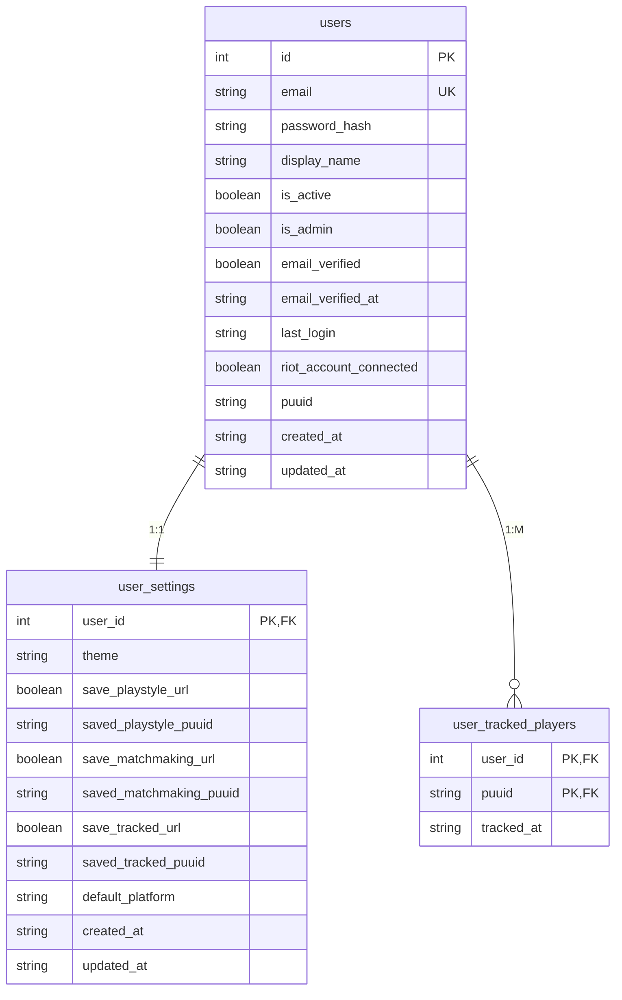
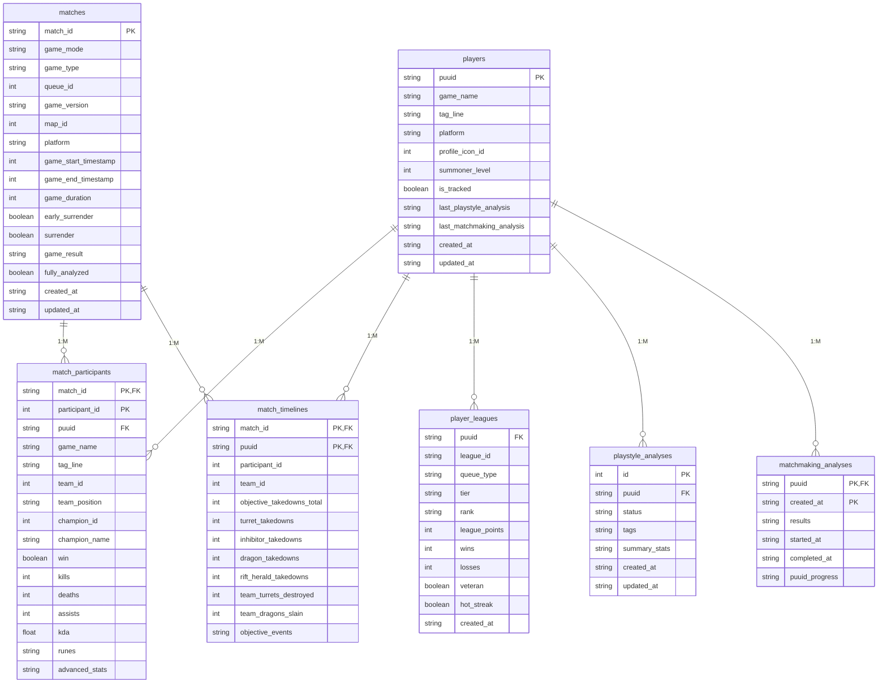
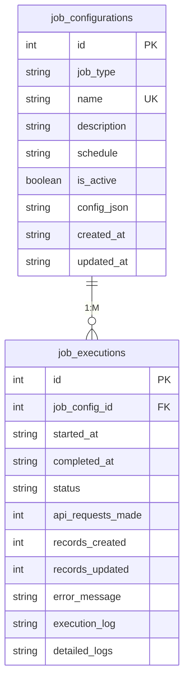

# Database Schema

PostgreSQL database schema for League Analysis. This document is auto-generated from `backend/init_database.sql`.

**Database**: PostgreSQL 18  
**ORM**: SQLAlchemy 2.0+  
**Schemas**: `auth`, `core`, `jobs`

---

## Entity Relationships

### Auth Schema

### Core Schema

### Jobs Schema

---

## Enum Types

### `jobs.job_status_enum`

- `PENDING` - Job queued
- `RUNNING` - Currently executing
- `SUCCESS` - Completed successfully
- `FAILED` - Error occurred
- `RATE_LIMITED` - Stopped due to API rate limits

### `jobs.job_type_enum`

- `MATCH_FETCHER` - Fetches new matches
- `PLAYER_UPDATER` - Updates tracked player profile data

### `core.analysis_status_enum`

- `PENDING` - Analysis queued
- `IN_PROGRESS` - Currently running
- `COMPLETED` - Finished successfully
- `FAILED` - Error occurred
- `CANCELLED` - User cancelled

### `auth.theme_enum`

- `LIGHT`
- `DARK`

---

## Key Tables

### `auth.users`

User authentication and authorization.

| Column          | Type         | Description                    |
| --------------- | ------------ | ------------------------------ |
| `id`            | bigint       | Primary key                    |
| `email`         | varchar(255) | Unique email                   |
| `password_hash` | text         | bcrypt hash                    |
| `display_name`  | varchar(128) | User display name              |
| `is_active`     | boolean      | Account enabled                |
| `is_admin`      | boolean      | Admin privileges               |
| `puuid`         | varchar(78)  | Linked Riot account (optional) |

**Trigger**: `trg_create_user_settings_after_user_insert` automatically creates `user_settings` record.

### `auth.user_tracked_players`

User-specific tracked player mappings.

| Column       | Type        | Description                              |
| ------------ | ----------- | ---------------------------------------- |
| `user_id`    | bigint      | FK to `auth.users.id`                    |
| `puuid`      | varchar(78) | FK to `core.players.puuid`               |
| `tracked_at` | timestamptz | When the player was added to this user   |

**Primary Key**: (`user_id`, `puuid`)  
**Behavior**: Jobs process players tracked by any user (distinct `puuid` set).

### `core.players`

Central player registry using Riot PUUID as primary key.

| Column       | Type        | Description              |
| ------------ | ----------- | ------------------------ |
| `puuid`      | varchar(78) | Primary key (Riot PUUID) |
| `game_name`  | varchar(16) | Riot ID game name        |
| `tag_line`   | varchar(5)  | Riot ID tag              |
| `platform`   | varchar(4)  | e.g., EUN1, EUW1         |
| `is_tracked` | boolean     | Derived global tracked flag |

### `core.matches`

Match metadata from Riot API.

| Column           | Type        | Description                      |
| ---------------- | ----------- | -------------------------------- |
| `match_id`       | varchar(20) | Primary key (e.g., EUN1_1234567) |
| `queue_id`       | int         | 420=Solo/Duo, 440=Flex           |
| `game_version`   | varchar(32) | Patch (e.g., "16.1.123")         |
| `fully_analyzed` | boolean     | All participants processed       |

### `core.match_participants`

Player performance data per match.

| Column           | Type        | Description                 |
| ---------------- | ----------- | --------------------------- |
| `match_id`       | varchar(20) | Part of composite PK        |
| `participant_id` | int         | Part of composite PK (1-10) |
| `puuid`          | varchar(78) | Player reference            |
| `kda`            | numeric     | Computed: (K+A)/D           |
| `runes`          | jsonb       | Full rune configuration     |
| `advanced_stats` | jsonb       | Riot "challenges" data      |

### `core.match_timelines`

Objective-focused timeline aggregates (1 row per participant per match).

| Column                     | Type        | Description                                                   |
| -------------------------- | ----------- | ------------------------------------------------------------- |
| `match_id`                 | varchar(20) | Part of composite PK, FK to `core.matches`                   |
| `puuid`                    | varchar(78) | Part of composite PK, FK to `core.players`                   |
| `participant_id`           | int         | Riot participant slot (1-10), unique per match               |
| `objective_takedowns_total` | int         | Total objective participations (killer or assister)          |
| `turret_takedowns`         | int         | Player turret takedowns (kill or assist)                     |
| `inhibitor_takedowns`      | int         | Player inhibitor takedowns (kill or assist)                  |
| `dragon_takedowns`         | int         | Player dragon takedowns (kill or assist)                     |
| `rift_herald_takedowns`    | int         | Player Rift Herald takedowns (kill or assist)                |
| `team_turrets_destroyed`   | int         | Team turret total from timeline events                       |
| `team_dragons_slain`       | int         | Team dragon total from timeline events                       |
| `objective_events`         | jsonb       | Compact objective event log (`t`,`o`,`r`, optional `l`,`s`,`m`) |

### `core.player_leagues`

Immutable league history snapshots (one row per rank change).

| Column          | Type        | Description                  |
| --------------- | ----------- | ---------------------------- |
| `puuid`         | varchar(78) | Player reference             |
| `tier`          | varchar(16) | IRON, BRONZE, ... CHALLENGER |
| `rank`          | varchar(4)  | I, II, III, IV               |
| `league_points` | int         | LP (0-100)                   |
| `created_at`    | timestamp   | Snapshot time                |

**Note**: No primary key - uses composite index on `(puuid, created_at DESC)` for current rank queries.

### `core.riot_api_keys`

Storage for Riot API keys.

| Column       | Type        | Description      |
| ------------ | ----------- | ---------------- |
| `id`         | int         | Primary key      |
| `key_value`  | varchar(42) | RGAPI-xxx format |
| `is_active`  | boolean     | Currently in use |
| `times_used` | bigint      | Usage counter    |

**Constraint**: Key must match `RGAPI-%` pattern with length 42.

### `jobs.job_configurations`

Background job definitions.

| Column      | Type          | Description             |
| ----------- | ------------- | ----------------------- |
| `id`        | int           | Primary key             |
| `job_type`  | job_type_enum | Job implementation      |
| `schedule`  | varchar(256)  | Interval in seconds     |
| `is_active` | boolean       | Scheduled for execution |
| `config_json` | jsonb       | Job-specific config (`interval_seconds`, queue toggles, etc.) |

**Default Match Fetcher config**: `enabled_queue_ids = [420, 440, 400, 450]` (Solo, Flex, Draft, ARAM).

### `jobs.job_executions`

Individual job run tracking.

| Column              | Type            | Description                   |
| ------------------- | --------------- | ----------------------------- |
| `id`                | int             | Primary key                   |
| `job_config_id`     | int             | References job_configurations |
| `status`            | job_status_enum | Execution result              |
| `api_requests_made` | int             | Riot API calls                |
| `detailed_logs`     | jsonb           | Captured log entries          |

---

## Source of Truth

**`backend/init_database.sql`** is the single source of truth for the database schema.

### Migration Workflow

1. Update SQLAlchemy models in `backend/app/features/*/models.py`
2. Update `backend/init_database.sql`
3. Generate and execute incremental `ALTER TABLE` statements and execute them using psql terminal
   - DB credentials are in `.env` file
4. Full DB reset: `psql -f backend/init_database.sql` - **DO NOT** do this ever, not even as
   a last resort, we have too much data in DB now and this would delete them all
