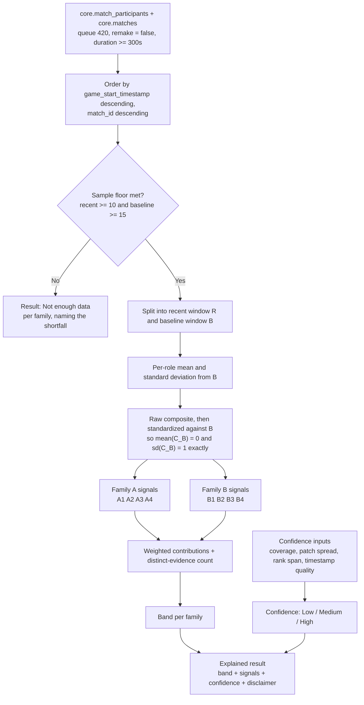
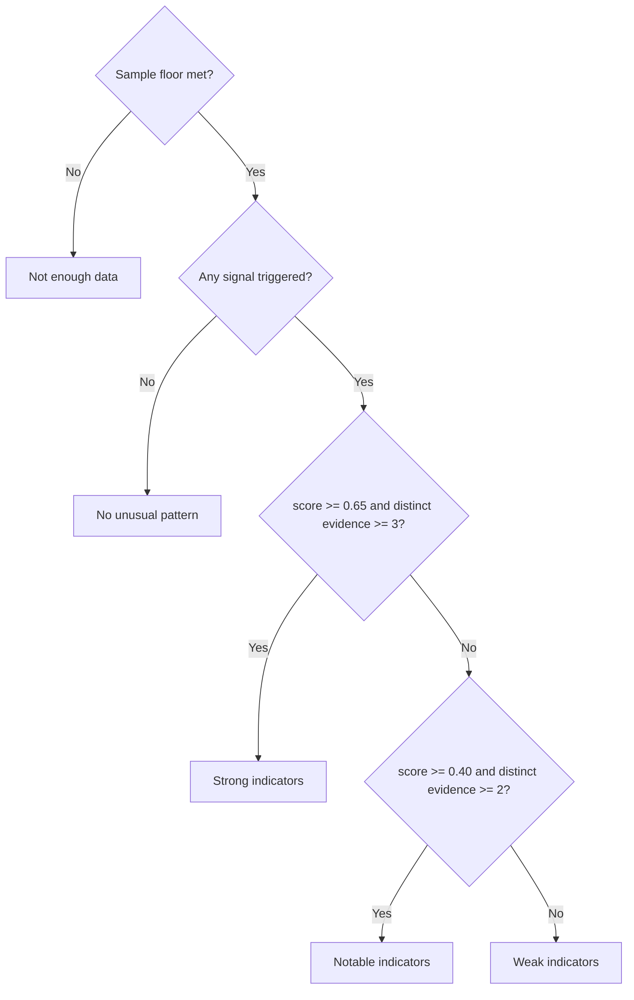

# Smurfing and Boosting Detection Model

> **Status:** LGA-19 specification, model version `smurf-boost/v1`. It
> authorizes the backend work in LGA-20 and the frontend work in LGA-21 but does
> not itself change current application behavior.
>
> **Authority:** Signal definitions, windows, normalization, scoring, presets,
> configurable ranges, result wording, and the validation plan for the first
> release. Schema changes remain owned by
> [`../backend/alembic/versions/`](../backend/alembic/versions/); per-user
> threshold storage extends the catalog contract in
> [`card-configuration.md`](card-configuration.md).

## Goal and boundaries

The landing page promises a tool that "will analyze player's match history and
check several factors, thresholds of the factors will be configurable per-user",
with the worked examples "a hard-stuck account starts rapidly climbing" and "a
high win rate account suddenly begins to lose a lot more".

This specification turns that promise into an explainable model with the
following hard boundaries:

- **The result is an indicator, not proof of misconduct.** No output may assert,
  imply, or numerically quantify that a player cheated, smurfed, or bought a
  boost. See [Result wording](#result-wording).
- **No additional Riot API traffic.** Detection reads only rows already stored
  by the ingestion jobs. It adds no rate-limiter participant and no writer to
  `RIOT_WRITER_TABLES`.
- **Self-referential comparison only.** A player is compared to their own
  earlier games, never to a population baseline. See
  [Why self-referential](#why-self-referential).
- **Two families, never collapsed.** Rapid-improvement evidence and
  account-change evidence are reported separately, each with its own band,
  confidence, and signal list.
- **Not a moderation surface.** The feature produces no report button, no export,
  no ranking of "most suspicious" players, and no cross-user aggregation.
- **Every threshold in this document is measured, not assumed.** See
  [Threshold derivation](#threshold-derivation).

## Recorded owner review

LGA-19 requires that user review of the proposed signals, thresholds, result
categories, and wording is recorded before implementation tickets proceed.

The owner delegated the four open model decisions to an independent review panel
on 2026-08-14 rather than answering them directly. The panel comprised the Fable
advisor, Codex `gpt-5.6-sol`, and the grok CLI, each consulted independently on
the same written brief containing the measured production figures below. A
fourth intended member (zcode CLI) was unavailable because the build machine has
no model provider configured.

| Decision | Outcome | Split |
| --- | --- | --- |
| Signal set | Eight signals; rank/LP is a confidence modifier only | 2–1 |
| Thresholds | Three presets with bounded overrides; **Conservative** default | 2–1 |
| Result wording | Four bands plus an explicit "Not enough data" state, no 0–100 score | unanimous |
| Screenshot data | Riot IDs anonymized in the disposable local restore before capture | unanimous |

The full panel record, including dissent and the additional constraints adopted
from it, is the review comment on LGA-19. Every outcome is a documented default
in this specification, so an owner veto costs a threshold edit rather than a
rewrite.

## Current data inventory

Measured against a read-only mirror of the production database at Alembic head
`20260812_0009`. These figures drive every design choice below and must be
re-measured before any threshold is retuned.

| Table | Rows | Detection relevance |
| --- | --- | --- |
| `core.players` | 24,560 | `summoner_level` is the only account-age proxy |
| `core.matches` | 2,985 | 2,755 are queue 420 (ranked solo/duo) |
| `core.match_participants` | 29,850 | All ten participants of every match are stored |
| `core.match_timelines` | 9,380 | Objective aggregates only; no per-frame curves |
| `core.player_leagues` | **30** | Rank snapshots; too sparse to score against |

Eligible ranked games per player, where *eligible* means the filter defined in
[Eligibility filter](#eligibility-filter) — queue 420, not a remake, and at
least 300 seconds long:

| Eligible games | Players |
| --- | --- |
| 100+ | 1 |
| 40–99 | 1 |
| 20–39 | 5 |
| 10–19 | 204 |
| 1–9 | 21,295 |
| 0 | 3,054 |

24,349 of 24,560 stored players have fewer than ten eligible ranked games.

### Fields the model may read

Verified 100% populated across all 29,850 participant rows:
`kills`, `deaths`, `assists`, `kda` (generated), `total_minions_killed`,
`neutral_minions_killed`, `gold_earned`, `gold_per_minute`, `vision_score`,
`vision_score_per_minute`, `kill_participation`, `team_damage_percentage`,
`damage_taken_on_team_percentage`, `solo_kills`, `largest_killing_spree`,
`laning_phase_gold_exp_advantage`, `max_cs_advantage`, `turret_plates_taken`,
`time_spent_dead`, `time_played`, `team_position`, `champion_id`, `win`,
`remake`. Joined `core.matches` adds `queue_id`, `game_duration`,
`game_start_timestamp`, `game_version`, `surrender`.

`laning_phase_gold_exp_advantage` is a **0/1 flag**, not a continuous
measurement — 2,638 of 29,850 rows (8.8%) carry the value 1 and the rest carry
0. It is therefore excluded from the composite, which standardizes continuous
quantities. `team_position` carries a sixth sentinel value `'Invalid'` (1,755
rows, none of which survive the eligibility filter today); it is excluded
explicitly rather than by accident.

### Fields the model must not rely on

| Absent or unreliable | Consequence |
| --- | --- |
| Account creation date | No true account age; `summoner_level` is a weak proxy only |
| MMR, rank at time of match | Rank cannot normalize per-match performance |
| Per-frame gold/XP curves | No lane-phase curve analysis |
| Reliable game start time | `game_start_timestamp_source` is `legacy_game_creation` for 1,960 of 2,985 matches, so the stored value is loading-screen creation time. **Time-of-day and session-clustering signals are excluded from v1.** Chronological *ordering* survives the skew, so game-order windows remain valid. |
| Dense rank history | 30 snapshots across five accounts, write-timestamped, with no `match_id` link and no backfill. **Rank velocity is excluded as a scoring signal.** |

### Why self-referential

24,349 of 24,560 stored players have fewer than ten eligible ranked games. There
is no population from which to derive a rank-normalized or role-normalized
expectation. Every threshold in this specification therefore compares a player to
their own earlier games. This also removes an entire class of unfairness: a
player is never flagged for being better than other people in the database.

## Model overview



## Windows, sample sizes, and eligibility

### Eligibility filter

A match enters either window only when all of the following hold:

- `matches.queue_id = 420` (ranked solo/duo). Other queues have different
  incentives and only 230 stored rows in total.
- `match_participants.remake = false`. Production holds 421 remakes; they carry
  no performance information.
- `matches.game_duration >= 300` seconds. This is a second guard for rows where
  `remake` is false but the game ended in the first five minutes.
- `match_participants.team_position` is one of `TOP`, `JUNGLE`, `MIDDLE`,
  `BOTTOM`, `UTILITY`. The `'Invalid'` sentinel is excluded.

Matches are excluded by this filter **before** windows are constructed, so a
remake can never occupy a slot in either window.

### Window construction

Eligible matches are ordered by `game_start_timestamp` descending, `match_id`
descending as the deterministic tie-breaker.

| Window | Symbol | Conservative default | Bounded range |
| --- | --- | --- | --- |
| Recent | `R` | 20 most recent eligible matches | 10–50 |
| Baseline | `B` | the 60 eligible matches immediately preceding `R` | 15–200 |

The windows never overlap. `B` starts at the first eligible match older than the
oldest match in `R`.

Where a signal needs to split `R` in half, the split is chronological and the
**older** half receives the extra match when `|R|` is odd:
`first_half` is the older `ceil(|R| / 2)` matches and `second_half` is the more
recent `floor(|R| / 2)` matches. No match is discarded.

### Sample floor

Both families return **Not enough data** unless `|R| >= 10` and `|B| >= 15`. The
floor is a hard constraint, not a user-configurable threshold: it is the guard
that stops the 204 players with 10–19 eligible games from producing noise. The
"Not enough data" result states how many eligible ranked games the player has and
how many are still required.

## Normalization

### Per-role standardization

Role variance dominates raw metrics. Measured on the deepest tracked account over
its 629 eligible games:

| Role | Games | Gold per minute |
| --- | --- | --- |
| BOTTOM | 116 | 468.4 |
| JUNGLE | 168 | 445.7 |
| TOP | 98 | 453.7 |
| MIDDLE | 99 | 428.5 |
| UTILITY | 148 | 330.8 |

Any cross-game comparison must therefore standardize within `team_position`.

Statistics are defined for every role appearing in `R` **or** `B`, and for each
composite metric `m`:

```
mu[r][m]    = arithmetic mean of m over matches in B with team_position = r
sigma[r][m] = population standard deviation (denominator n) of m
              over the same matches
```

When a role has fewer than five matches in `B` — including a role that appears
only in `R` and therefore has none — that role falls back to the pooled `B`
distribution and every affected match carries the data-quality note
`role_baseline_pooled`. A role that appears only in `R` is never left without a
baseline.

`sigma` is floored to keep the z-score defined for a degenerate distribution:

```
sigma_effective = max( sigma[r][m], 0.05 * abs(mu[r][m]), EPSILON )
                  where EPSILON = 1e-9
```

The absolute `EPSILON` term is what makes the floor strictly positive even when
both `sigma` and `mu` are zero.

### Composite performance score

For match `i` with role `r`, using

```
minutes        = (time_played > 0) ? time_played / 60 : game_duration / 60
cs_per_minute  = (total_minions_killed + neutral_minions_killed) / minutes
```

Eligibility guarantees `game_duration >= 300`, so `minutes` is always positive
even when the stored `time_played` is zero. A match that falls back to
`game_duration` carries the note `time_played_missing`.

```
z[i][m]  = clamp( (x[i][m] - mu[r][m]) / sigma_effective[r][m], -3, +3 )

C_raw[i] = 0.25 * z[i][kda]
         + 0.20 * z[i][gold_per_minute]
         + 0.15 * z[i][kill_participation]
         + 0.15 * z[i][team_damage_percentage]
         + 0.15 * z[i][cs_per_minute]
         + 0.10 * z[i][vision_score_per_minute]
```

A weighted sum of correlated z-scores does **not** have unit variance. Measured
on the deepest account, `sd(C_raw)` over a 60-game baseline is `0.679`, and over
185 ordinary-play window pairs it ranges from `0.57` to `0.71`. Every threshold
in this specification is expressed in standard deviations of the player's own
baseline, so the composite is standardized against `B` before use:

```
mu_C    = arithmetic mean of C_raw over B
sd_C    = population standard deviation of C_raw over B

C[i]    = (C_raw[i] - mu_C) / sd_C        defined only when sd_C > EPSILON
```

By construction `mean(C_B) = 0` and `sd(C_B) = 1` **exactly**, which is what
makes `mean(C_R)` literally readable as "how many baseline standard deviations
above their own baseline this player has been playing". This has been verified
empirically on all three accounts with sufficient history.

When `sd_C <= EPSILON` the baseline is **degenerate** — every baseline game is
effectively identical on every composite metric — and `C` is not defined at all.
Every signal that reads `C` (A1, A3, A4, B1, B2, and B3) is then reported as
**unavailable** with the note `degenerate_baseline`. Only A2 and B4, which read
win rate alone, remain computable. The division is never performed against a
floored denominator, so `sd(C_B) = 1` holds without exception wherever `C`
exists.

Weights sum to 1.0 and are part of the versioned model, not user-configurable.
`damage_taken_on_team_percentage`, `solo_kills`, `largest_killing_spree`,
`turret_plates_taken`, `max_cs_advantage`, and `time_spent_dead` are excluded
from the composite: each is either role-ambiguous in direction or strongly
collinear with a metric already present. `laning_phase_gold_exp_advantage` is
excluded because it is a binary flag. All remain available to future model
versions.

### Patch handling

`matches.game_version` is recorded per match. Patch changes shift metric scales.
v1 does not rescale per patch — the windows are short enough that a patch
boundary inside them is more usefully treated as a confidence penalty. When `R`
and `B` share no `major.minor` patch prefix, confidence is reduced and the note
`patch_disjoint_windows` is attached.

### Outlier handling

`z` values are clamped at ±3 before entering the composite, so a single 30-kill
game cannot by itself move a window mean. No matches are discarded as outliers:
removing a player's best games would defeat the purpose of the tool.

## Signal catalog

Eight signals in two families. Each signal emits a fixed record:

```
{
  id, family, available, raw_value, threshold, saturation, triggered,
  magnitude, weight, contribution, sample_size, reason, notes[]
}
```

When `available` is `false`, `raw_value`, `threshold`, `saturation`, `magnitude`
and `contribution` are all null, `triggered` is `false`, and `notes` carries the
reason. An unavailable signal never triggers, never scores, and never counts as
evidence; it is displayed as unavailable rather than as a passed check.

`magnitude` ramps the contribution so a value that just crosses its threshold
does not score the same as one far past it:

```
ramp         = clamp( (raw_value - threshold) / (saturation - threshold), 0, 1 )
magnitude    = triggered ? max(ramp, MIN_MAGNITUDE) : 0    where MIN_MAGNITUDE = 0.10
contribution = weight * magnitude
```

`MIN_MAGNITUDE` exists because `ramp` is exactly zero when `raw_value` equals the
threshold. Without it, a signal could be reported as triggered, be shown to the
user, count as evidence, and still contribute nothing to the score. A triggered
signal always contributes at least a tenth of its weight.

Saturation is a fixed model constant for every signal and is always strictly
greater than the top of that signal's bounded threshold range, so the denominator
is always positive. The thresholds quoted per signal below are the
**Conservative** values, which are the shipped defaults; the
[preset table](#presets) is authoritative for all three presets.

### Family A — rapid improvement

Weights: A1 0.30, A2 0.25, A3 0.25, A4 0.20. They sum to 1.00.

#### A1 — Performance step change

Standardized mean difference of the composite between the windows, with the
Hedges small-sample correction. `var` is the **unbiased sample variance**
(denominator `n - 1`).

```
s_pooled = sqrt( ( (n_R - 1) * var(C_R) + (n_B - 1) * var(C_B) ) / (n_R + n_B - 2) )
J        = 1 - 3 / (4 * (n_R + n_B) - 9)
g        = J * (mean(C_R) - mean(C_B)) / s_pooled
```

Raw value `g`. Conservative threshold **1.20**, saturation **3.00**, weight
**0.30**. Unavailable when `s_pooled` is zero.

#### A2 — Win-rate surge

Guarded so a small recent window cannot trigger on variance. Uses the Wilson
score interval at 95%.

```
wilson_lower(k, n) = ( p + z2/(2n) - z * sqrt( p*(1-p)/n + z2/(4n^2) ) ) / (1 + z2/n)
                     where p = k/n, z = 1.96, z2 = z*z

raw_value = wilson_lower(wins_R, n_R) - (wins_B / n_B)
```

Comparing the Wilson *lower* bound of the recent window against the plain
baseline rate means the signal fires only when the surge survives the worst case
of its own sample size. Conservative threshold **0.20**, saturation **0.50**,
weight **0.25**.

#### A3 — Novel-champion overperformance

A champion is *novel* when the player has at most two eligible stored games on it
across their **entire stored history older than the recent window** — not merely
within the baseline window, which would make almost every champion novel.

```
novel_matches = { i in R : prior_eligible_games(champion_id[i]) <= 2 }
raw_value     = mean( C[i] for i in novel_matches ) - mean(C_B)
```

Requires `|novel_matches| >= minimum_novel_games`; otherwise the signal reports
`insufficient_novel_sample`, is unavailable, and does not trigger. Conservative
minimum **8**, threshold **1.20**, saturation **3.00**, weight **0.25**.

This signal is honest about its limitation: "novel" means *not previously stored
by this application*, not *never played by this person*. The reason text and the
`novel_is_storage_scoped` note say so.

#### A4 — Low account level with high performance

```
raw_value = mean(C_R)
gate      = players.summoner_level is not null
            and players.summoner_level <= level_gate     (Conservative 45)
```

Triggers only when the gate holds and `raw_value` crosses its threshold.
`players.summoner_level` is nullable; when it is null the signal is
**unavailable** with the note `summoner_level_unknown` and is never treated as
passing the gate. Conservative threshold **1.20**, saturation **3.00**, weight
**0.20** — deliberately the smallest weight in the family. `summoner_level` is a
current value, not a creation date; ranked play starts at level 30 and levels
accrue from every queue. The reason text always carries the
`weak_account_age_proxy` note.

### Family B — account change

Weights: B1 0.30, B2 0.25, B3 0.20, B4 0.25. They sum to 1.00.

#### B1 — Win-rate surge without matching performance

The landing page's "hard-stuck account starts rapidly climbing" case, expressed
without rank data. The stored data cannot establish rank movement, so this signal
measures a **win-rate** surge that the player's own per-game performance does not
explain. It does not claim to observe a climb.

```
win_rate_delta  = (wins_R / n_R) - (wins_B / n_B)
composite_delta = mean(C_R) - mean(C_B)

triggered when win_rate_delta >= threshold          (Conservative 0.30)
              and composite_delta <= flat_ceiling   (Conservative 0.05)
raw_value = win_rate_delta
```

The composite ceiling is a pure **gate**; the magnitude ramp reads
`win_rate_delta` directly, so a triggered B1 can never contribute zero.
Saturation **0.60**, weight **0.30**.

#### B2 — Performance-consistency shift

The originally proposed champion-pool and role divergence measure was tested and
rejected. Over the 185 calibration window pairs the Jensen–Shannon divergence of
the champion distribution had a median of **0.669** and a maximum of **0.965**
on a 0–1 scale, and the role distribution a median of **0.268** and a maximum of
**0.913**. Champion pools and autofilled roles churn so heavily between a 20-game
and a 60-game window that no threshold leaves usable headroom. Pool divergence is
therefore not a supportable signal on this data.

What does have headroom is a change in how *consistent* the player is — the
spread of per-game outcomes rather than their level. This specification claims
only that the spread changed and that such a change is rare in the observed
history. It does not claim that compression means a stronger hand or that
expansion means two people; with no labelled cases, no such construct validity
has been established, and the result text must not assert one.

```
ratio     = sd(C_R) / sd(C_B)          note that sd(C_B) = 1 by construction
raw_value = abs( log2(ratio) )
```

A raw value of 1.0 means the recent window is either half or double the baseline
spread. Measured over the calibration set the median is **0.168** and the 95th percentile
**0.541**. Conservative threshold **1.15**, saturation **2.00**, weight **0.25**.
Unavailable when `sd(C_R)` is zero.

#### B3 — Bimodal performance split

Games far above baseline and games at or below it, both present in the same
window. The statistic uses distribution moments only and contains no ordering
term, so a block of strong games followed by a block of weak ones scores the same
as an alternating sequence.

Estimators are stated exactly, because library defaults differ. All three central
moments use the **population** denominator `n`, and the standardization divides
by `m2`, not by the sample standard deviation — mixing the two produces a
different statistic and a different threshold. With `n = n_R`:

```
m2 = sum( (C[i] - mean(C_R))^2 ) / n
m3 = sum( (C[i] - mean(C_R))^3 ) / n
m4 = sum( (C[i] - mean(C_R))^4 ) / n

g1 = (m3 / m2^1.5) * sqrt(n * (n - 1)) / (n - 2)          bias-corrected skewness
g2 = ((n - 1) * ((n + 1) * (m4 / m2^2 - 3) + 6))
     / ((n - 2) * (n - 3))                                bias-corrected excess kurtosis

BC = (g1^2 + 1) / ( g2 + 3 * (n - 1)^2 / ((n - 2) * (n - 3)) )

high_fraction = |{ i in R : C[i] >= +1.0 }| / n_R
low_fraction  = |{ i in R : C[i] <= -0.5 }| / n_R

triggered when BC > bimodality_threshold                  (Conservative 0.65)
              and high_fraction >= tail_fraction          (Conservative 0.30)
              and low_fraction  >= tail_fraction
raw_value = BC
```

The trigger reads the **configured** threshold, so the preset value is live
rather than decorative. `n_R >= 12` is required as a stability floor — the `g2`
denominator is merely defined for `n > 3`, but the estimate is unusable below 12.
Below that, or when `m2` is zero, the signal reports
`insufficient_shape_sample` and is unavailable. Saturation **0.90**, weight
**0.20**.

Measured with these exact estimators over the calibration set, `BC` has a median
of 0.381 and a maximum of 0.630 on observed history, so the Conservative pair
(`BC > 0.65`, both tails `>= 0.30`) never fires on it.

#### B4 — Sudden sustained reversal

The landing page's "high win rate account suddenly begins to lose a lot more"
case. Sustained is enforced by splitting the recent window chronologically and
requiring both halves to sit below the baseline.

```
baseline_rate = wins_B / n_B
drop          = baseline_rate - (wins_R / n_R)

triggered when baseline_rate >= high_rate_floor       (Conservative 0.62)
              and drop >= threshold                   (Conservative 0.20)
              and win_rate(first_half(R))  <= baseline_rate - 0.05
              and win_rate(second_half(R)) <= baseline_rate - 0.05
raw_value = drop
```

Saturation **0.60**, weight **0.25**.

B1 and B4 are mutually exclusive by direction: B1 requires a win-rate rise and B4
a fall. They can never trigger on the same result.

## Scoring and bands

### Family score

Each family's weights sum to exactly 1.00, so the score needs no normalization:

```
score(family) = sum( contribution for each triggered signal in that family )
```

The value therefore lies in `[0, 1]`.

### Distinct-evidence guard

Several signals read the same underlying quantity and must not be counted as
separate corroboration. Signals are grouped by *which statistic they read*, and
each group contributes at most one unit of evidence:

| Family | Evidence group | Signals | Statistic read |
| --- | --- | --- | --- |
| A | location | A1, A4 | the mean of `C_R` |
| A | novel subset | A3 | the mean of `C` over the novel-champion subset of `R` |
| A | win rate | A2 | recent versus baseline win rate |
| B | win rate | B1, B4 | recent versus baseline win rate |
| B | spread | B2 | the second moment of `C_R` |
| B | shape | B3 | the third and fourth moments of `C_R` |

```
distinct_evidence(family) =
    count of evidence groups in that family with at least one triggered signal
```

Both families can therefore reach a maximum of three. A1 and A4 read literally
the same number — the mean of `C_R` — so a result carried by those two alone
counts once, not twice.

These groups are **not statistically independent** and the specification does not
claim they are. They are computed over the same matches, and the moments of one
distribution are correlated in general. The guard is a deliberately conservative
floor on how much corroboration a result may claim, not an independence proof.
The result wording says "areas", never "independent signals".

### Band assignment



A triggered signal always produces at least **Weak indicators**, so the interface
can never display a triggered signal beside the words "Nothing in the stored
history stands out". A high score carried by a single evidence group lands at Weak
regardless of its magnitude: A1 and A4 both fully saturated give a Family A score
of 0.50 with one evidence group, which without the guard would read as Notable.

### Confidence

Confidence is reported separately from the band and never modifies it. It is a
statement about the evidence, not about the player.

```
target_R      = the configured recent window size
target_B      = the configured baseline window size

coverage      = min(1, n_R / target_R) * min(1, n_B / target_B)
patch_factor  = 1.00 if R and B share a major.minor patch prefix else 0.85
time_factor   = 1.00 if every match in R and B has
                game_start_timestamp_source = 'riot_game_start' else 0.90
rank_span_days = (max(created_at) - min(created_at)) in days, over
                 core.player_leagues rows for this puuid with
                 queue_type = 'RANKED_SOLO_5x5'

rank_factor   = 1.00 + 0.05 * min(1, rank_span_days / 30)
                when at least two such snapshots exist,
                and exactly 1.00 otherwise

confidence = clamp(coverage * patch_factor * time_factor * rank_factor, 0, 1)
```

`rank_factor` is a **data-availability** term, not corroboration. It says only
that an independent record of this account exists over a meaningful period; it is
never aligned to a window, never compared against a signal's direction, and can
move confidence by at most five percent. It is driven by the **span** of rank
history, not the number of snapshots: the production account with 19 snapshots
holds them across three days, which is dense and short. Rank history can never
trigger or weight a signal.

| Confidence | Band |
| --- | --- |
| `confidence < 0.50` | Low |
| `0.50 <= confidence < 0.80` | Medium |
| `confidence >= 0.80` | High |

Missing rank history yields the note `rank_corroboration_unavailable`. It is
neutral: absent rank data must not be read as reduced confidence in signals that
never needed it.

## Threshold derivation

No threshold in this document was chosen by intuition. Each was selected by
measuring how often the rule fires across the **observed stored history**.

### Calibration set

The set is 185 window pairs, generated by this exact procedure over the three
production accounts with enough eligible history:

```
for each account, over its eligible matches ordered newest first:
    for offset in 0, 3, 6, ... while offset < max(1, total_eligible - 80):
        R = matches[offset : offset + 20]
        B = matches[offset + 20 : offset + 80]
        keep the pair when |R| >= 10 and |B| >= 15
```

The baseline is truncated rather than skipped when fewer than 60 matches remain,
which is why the two shallow accounts contribute a pair at all:

| Account eligible games | Pairs contributed | Baseline size |
| --- | --- | --- |
| 629 | 183 | 60 |
| 42 | 1 | 22 |
| 39 | 1 | 19 |
| **Total** | **185** | |

### What the measurement does and does not establish

None of these accounts is labelled. They are not known to be clean, so the
figures below are **observed trigger rates on stored history**, not false-positive
rates. A rule that fires on 0% of them is not proven correct; it is only shown
not to fire on the history this application actually holds. That is the weakest
claim consistent with the data, and it is the claim being made.

| Signal rule at its Conservative value | Observed trigger rate |
| --- | --- |
| A1 `g >= 1.20` | 0.0% (0/185) |
| A2 Wilson delta `>= 0.20` | 1.6% (3/185) |
| A3 `>= 1.20` with at least 8 novel games | 0.0% (0/185) |
| A4 `mean(C_R) >= 1.20` | 0.5% (1/185) |
| B1 `win_rate_delta >= 0.30` and `composite_delta <= 0.05` | 1.1% (2/185) |
| B2 `abs(log2(sd ratio)) >= 1.15` | 0.0% (0/185) |
| B3 `BC > 0.65` and both tails `>= 0.30` | 0.0% (0/185) |
| B4 base `>= 0.62`, drop `>= 0.20`, both halves down | 0.0% (0/185) |

For contrast, the thresholds originally proposed before measurement fired far
more often on the same set: A1 at 0.80 fires 2.2% of the time, B1 at
`0.15 / 0.20` fires 8.1%,
and the rejected champion-pool divergence at 0.45 fires on the substantial
majority of ordinary windows.

Any retune must repeat this measurement. The exact statistics were produced by
standalone scripts against a read-only restore; they are not application code and
are not committed.

## Configuration

### Storage

Per-user thresholds extend the versioned catalog contract in
[`card-configuration.md`](card-configuration.md): an allowlisted catalog,
viewer-scoped settings containing no PUUID, Riot ID, or match data, camelCase
over the API and snake_case in storage, `(user_id, card_id, version)` coexistent
rows, and strict server-side validation.

The card identifier is `profile.smurf-boost-detection`, catalog version `1`,
following the existing namespaced convention (`profile.top-champions`,
`profile.recent-performance`). `card-configuration.md` scopes its allowlist to
"exactly these v1 cards", so **adding this card is a catalog extension that needs
owner approval** alongside the approval of this specification.

`requiresRecovery` keeps the contract's existing narrow meaning: it is set only
when a stored **current-version** preference contained a malformed, removed, or
out-of-range field and the server substituted a default. A stored preference for
a known card at a *future* version falls back to defaults and emits a warning
without setting the flag.

### Presets

Three complete, validated threshold sets. **New users start on Conservative.**
There is no labelled ground truth in this database, so "Balanced" would be a name
rather than a calibration, and the error direction for a misconduct-adjacent
indicator is to under-report. Switching preset is a single click.

Every bounded range top is strictly below its signal's fixed saturation, so the
magnitude denominator is always positive.

| Parameter | Conservative (default) | Balanced | Sensitive | Bounded range | Saturation |
| --- | --- | --- | --- | --- | --- |
| Recent window size | 20 | 20 | 15 | 10–50 | — |
| Baseline window size | 60 | 40 | 30 | 15–200 | — |
| A1 step-change threshold | 1.20 | 1.00 | 0.80 | 0.60–2.00 | 3.00 |
| A2 win-rate surge threshold | 0.20 | 0.15 | 0.12 | 0.10–0.35 | 0.50 |
| A3 novel-champion threshold | 1.20 | 1.00 | 0.80 | 0.60–2.00 | 3.00 |
| A3 minimum novel games | 8 | 5 | 5 | 5–15 | — |
| A4 summoner-level gate | 45 | 60 | 80 | 30–150 | — |
| A4 performance threshold | 1.20 | 1.00 | 0.80 | 0.60–2.00 | 3.00 |
| B1 win-rate delta threshold | 0.30 | 0.25 | 0.20 | 0.15–0.45 | 0.60 |
| B1 composite flat ceiling | 0.05 | 0.10 | 0.20 | 0.00–0.40 | — |
| B2 consistency-shift threshold | 1.15 | 1.00 | 0.85 | 0.60–1.50 | 2.00 |
| B3 bimodality threshold | 0.65 | 0.60 | 0.555 | 0.555–0.80 | 0.90 |
| B3 tail fraction | 0.30 | 0.25 | 0.20 | 0.15–0.40 | — |
| B4 high-rate floor | 0.62 | 0.58 | 0.55 | 0.50–0.80 | — |
| B4 drop threshold | 0.20 | 0.15 | 0.12 | 0.10–0.45 | 0.60 |

Measured over the same 185 calibration windows, the Sensitive preset raises the
per-signal trigger rate to between 1.1% (B3) and 3.8% (B1), and Balanced sits
between the two. That is the entire practical meaning of the preset choice.

### What users cannot change

These are correctness constraints, not preferences, and the API rejects any
attempt to set them:

- The sample floor (`|R| >= 10`, `|B| >= 15`) and the `n_R >= 12` floor for B3.
- Queue restriction to 420 and the remake, duration, and `'Invalid'`-position
  exclusions.
- Composite metric membership, weights, the `z`-clamp at ±3, the `sigma` floor,
  and the standardization of `C` against `B`.
- Signal weights, saturation constants, `MIN_MAGNITUDE`, and the evidence grouping.
- Band thresholds and the confidence formula.

### Validation of a submitted configuration

The server validates a submitted set in this order, rejecting with a
field-scoped message on the first failure:

1. Every key is a known catalog key for this card version.
2. Every value has the declared type.
3. Every value lies inside its bounded range.
4. Cross-field consistency:
   - `a3_minimum_novel_games <= recent_window_size`, so A3 can be satisfiable;
   - `b3_bimodality_threshold` at least `0.555`, the uniform-distribution
     reference value below which the coefficient is not evidence of bimodality;
   - `recent_window_size >= 12` when B3 is to be evaluated, otherwise B3 is
     reported unavailable rather than rejected.

A set that passes is stored whole; partial application is not offered.

## Result wording

### Bands

Exactly five states per family, with this fixed vocabulary:

| State | Meaning shown to the user |
| --- | --- |
| Not enough data | Fewer eligible ranked games than the model requires |
| No unusual pattern | Nothing in the stored history stands out |
| Weak indicators | One area moved; likely ordinary variance |
| Notable indicators | Two different areas moved together |
| Strong indicators | Three different areas moved together and by a wide margin |

Family A is presented as **Rapid improvement pattern**; Family B as **Playing
pattern change**. Neither family name contains the words smurf, boost, cheat, or
account sharing outside the feature title and its explanatory copy.

### Required elements of every result

1. The band, per family.
2. The confidence band, presented next to but visually distinct from the result
   band.
3. Every triggered signal, in plain language, with its raw value, its threshold,
   and the number of games it looked at.
4. Every signal that was **unavailable**, with the reason, so an absent signal is
   never mistaken for a passed check.
5. Every data-quality note that applies.
6. A fixed, always-visible disclaimer — not a tooltip, not collapsed:

   > This is a statistical comparison of a player's recent ranked games against
   > their own earlier games. It is not evidence of smurfing, boosting, or
   > account sharing, and it cannot distinguish improvement from any other
   > explanation. Do not use it to accuse anyone.

### Forbidden output

No result may use "smurf detected", "likely boosted", "suspicious",
"suspicious activity", "clean", "legitimate", "verified", "confirmed", a
percentage or 0–100 score per family, a probability, or any comparison against
other players. The internal weighted sum is never displayed; bands only.

"Not enough data" is a first-class outcome and the majority result on this
database. It is designed as an informative state — it names how many eligible
ranked games exist and how many are needed — not an error and not a toast.

## Validation plan

### Synthetic fixtures

Following existing backend practice, the computation engine is pure and tested
with constructed participant rows rather than a database. Each fixture asserts a
band, the exact set of triggered signal identifiers, and the exact set of
unavailable ones. Every fixture fixes all confidence inputs explicitly — patch
prefix, `game_start_timestamp_source`, and league-snapshot count — so the
asserted confidence band is deterministic. Unless a fixture names a preset, it
runs against **Conservative**.

| Fixture | Construction | Expected |
| --- | --- | --- |
| `flat_baseline` | 80 games, all `MIDDLE`, every metric drawn from one fixed distribution; recent 20 at 10/20 wins and baseline 60 at 30/60 wins | No signal triggered, both families No unusual pattern. Asserted against all three presets. |
| `below_floor` | 9 eligible recent games | Both families: Not enough data, naming the shortfall |
| `remakes_excluded` | 30 raw matches of which 15 are remakes and 5 under 300s | Windows contain only the 10 eligible matches; result is Not enough data |
| `invalid_position_excluded` | Baseline containing `'Invalid'` rows | Those rows never reach `mu[r][m]` |
| `degenerate_baseline` | Every baseline game identical on all six composite metrics, so `sd_C <= EPSILON` | A1, A3, A4, B1, B2, B3 all unavailable with `degenerate_baseline`; A2 and B4 still computed; no division performed |
| `step_change` | Recent 20 with every `C[i]` at exactly +2.0, baseline 60 standard normal by construction | A1 `g` at least 1.20 — triggered; band at least Weak |
| `winrate_surge_small` | Recent 10 at 9/10 wins, baseline 30/60 | A2 raw 0.0958 — **not** triggered at any preset; the Wilson guard holds |
| `winrate_surge_large` | Recent 30 at 24/30 wins, baseline 30/60 | A2 raw 0.1269 — triggered under Sensitive (0.12) only; Balanced (0.15) and Conservative (0.20) both hold. Asserted per preset. |
| `winrate_surge_conservative` | Recent 30 at 27/30 wins, baseline 30/60 | A2 raw 0.2438 — triggered under all three presets |
| `novel_champions` | 8 recent games on champions with zero prior games, +2.0 sd | A3 triggered with `novel_is_storage_scoped` |
| `novel_below_minimum` | 6 novel games at +2.0 sd, Conservative minimum 8 | A3 unavailable with `insufficient_novel_sample` |
| `low_level_high_perf` | `summoner_level` 38, recent +1.5 sd | A4 triggered, `weak_account_age_proxy` present |
| `null_summoner_level` | `summoner_level` null, recent +1.5 sd | A4 unavailable with `summoner_level_unknown` |
| `winrate_without_performance` | Win rate 40% → 75%, composite unchanged | B1 triggered, contribution greater than zero |
| `consistency_collapse` | `sd(C_R)` 0.35 against baseline 1.0 | B2 raw `abs(log2 0.35)` = 1.5146 — triggered at Conservative (1.15) |
| `consistency_expansion` | `sd(C_R)` 2.5 against baseline 1.0 | B2 raw `abs(log2 2.5)` = 1.3219 — triggered at Conservative (1.15) |
| `champion_pool_churn` | Recent window on an entirely different champion pool, composite and win rate unchanged | **No** signal triggered — the rejected divergence measure must not have been reinstated |
| `bimodal_split` | Recent 20 with exactly 10 games at `C = +1.5` and 10 at `C = -1.0`, no other values | `BC = 0.7669`, high 0.50, low 0.50 — B3 triggered at Conservative |
| `bimodality_estimator` | Recent 20 with 7 games at `C = +1.5`, 7 at `C = -1.0`, 6 at `C = 0.0` | `BC = 0.5660` under the specified `m2`-based estimators — **not** triggered at Conservative. Pins the estimator choice: a sample-`s` variant gives a different value. |
| `sustained_reversal` | Baseline 42/60, both halves of recent at 40% | B4 triggered |
| `reversal_not_sustained` | Baseline 42/60 (0.700), recent 9/20 (0.450) split as 2/10 then 7/10 | Aggregate drop 0.250 clears 0.20, but the second half at 0.700 exceeds `0.700 − 0.05`, so B4 is **not** triggered — the halves guard is what stops it |
| `single_evidence_group` | A1 and A4 both at full magnitude, nothing else | Score 0.50, distinct evidence 1, band **Weak** — without the guard the same score would read Notable |
| `strong_family_a` | A1, A2 and A3 all triggered at full magnitude | Score 0.80, distinct evidence 3, band Strong |
| `patch_disjoint` | Windows on different `major.minor` prefixes | Confidence multiplied by 0.85, `patch_disjoint_windows` present |
| `pooled_role_baseline` | Baseline with 4 games in the recent window's role | `role_baseline_pooled` present on affected matches |
| `rank_span_short` | 19 league snapshots spanning 3 days | `rank_factor` at most 1.005 — density must not be read as corroboration |

### Anonymized historical examples

Three production accounts hold enough eligible history for an end-to-end check —
629, 42, and 39 eligible ranked games. They are used through an anonymized local
restore in which `game_name` and `tag_line` are rewritten to synthetic values on
both `core.players` and `core.match_participants`; all statistics stay real.

These accounts verify that the pipeline runs on genuine sparse data and that the
Conservative default does not fire on the history the application holds. They
also constrain the
model: the account with 39 eligible games yields `|B| = 19` under the
Conservative baseline size of 60, so it exercises a short-baseline path rather
than a full window. They are not ground truth and must never be described as
confirmed cases.

### Expected error tradeoffs

The Conservative default is **chosen to prioritize under-reporting**. It is not
"tuned" in the sense of validated against labelled cases, because no labelled
cases exist; the word is reserved for that meaning.

- **False positives are the expensive error.** A first-run "Notable indicators"
  on a lucky streak is an accusation that a disclaimer cannot unsay. Every guard
  in the model — the Wilson bound, the sample floor, the evidence grouping, the
  sustained-reversal halves check, the triggered-signal requirement for leaving
  "No unusual pattern" — exists to raise the cost of triggering. The measured
  per-signal trigger rate over the calibration set at Conservative values is
  between 0.0% and 1.6%.
- **False negatives are the accepted error.** The tool is expected to say "No
  unusual pattern" or "Not enough data" for the overwhelming majority of players
  in this database, and that is the correct behavior at 24,349 players with fewer
  than ten eligible games.
- **Neither error rate is measurable.** With no labelled cases, the calibration
  figures are observed trigger rates on unlabelled history, not false-positive
  rates, and nothing here measures sensitivity. The specification makes no claim
  about either, and the product must not imply one.
- **Presets are validated as sets, not sliders.** Sensitive A1 plus Sensitive A2
  plus Sensitive B3 stack; each preset is asserted end to end against the fixture
  suite above, and no preset may move `flat_baseline` off "No unusual pattern".

## Backend implementation

The model is implemented in `backend/app/features/smurf_boost_detection/`, split
so the computation stays pure and independently testable:

| Module | Responsibility |
| --- | --- |
| `config.py` | Every fixed model constant: weights, saturations, band thresholds, evidence groups, presets |
| `statistics.py` | Wilson bound, Hedges `g`, bimodality coefficient, log-ratio — each estimator spelled out rather than delegated |
| `composite.py` | Eligible-match shape, per-role standardization, and the baseline-standardized composite |
| `signals.py` | The eight signals, each a pure function returning one explainable record |
| `engine.py` | Windows, sample floor, family scoring, bands, confidence — no database, no Riot call |
| `models.py`, `service.py`, `router.py` | Persistence, lifecycle and the authenticated HTTP surface |

Results persist to `core.smurf_boost_analyses` (revision `20260814_0010`), one
row per `(puuid, created_at)`, storing the `model_version` and the exact
`thresholds` used. A one-active-row partial unique index plus an
IntegrityError-to-attach path makes a repeated request attach to the run already
in flight rather than start a second one; this is verified against a real
PostgreSQL instance, where five concurrent analyses produce exactly one row.

A request only attaches to an in-flight run when that run's `model_version` and
every threshold value match its own. A run configured differently is a
retryable conflict (`409`, code `analysis_in_progress`), never a silent
substitution of another viewer's settings. Because the computation completes
inside its request, an active row older than ten minutes belongs to a process
that died; it is marked failed before the next claim, so one interrupted
request cannot wedge the feature for that player.

Staleness is decided by comparing `latest_match_id` against the player's newest
eligible match, not by comparing counts — the service caps how many matches it
loads, so a count comparison would report every capped run as stale. A stored
identifier of `None` takes part in that comparison like any other value, so a
run computed over an empty history goes stale as soon as a first game arrives.

### Two boundaries the load cap must not cross

The service loads at most 250 matches, which is all the largest configurable
windows can consume. Two values are nevertheless read from the player's whole
eligible history, because truncating them changes what the model means:

- `eligible_games`, counted with a separate aggregate. Reporting the loaded
  slice would understate a long history and make the staleness comparison
  meaningless.
- The prior-champion counts behind A3, read with the same eligibility
  predicate offset past the recent window and with no limit. On the deepest
  stored account the capped counting saw 230 games across 68 champions against
  609 games across 99 champions for the full history, and **35 champions with
  real stored history would have been treated as newly picked**.

### Result payload

The stored document and the HTTP response are the same validated
`SmurfBoostResults` shape, built in one place. Each signal is emitted as `id`
plus `family`; the fixed disclaimer is always present; and the internal
weighted sum that produced a band is retained only in memory, so no per-family
number is ever persisted or sent to a client.

`GET /api/v1/smurf-boost-detection/presets` emits each preset in the card
settings write contract's own field names and numeric types, so a client can
apply a preset by posting it back unchanged.

Viewer thresholds are resolved through the card catalog's
`normalize_stored_card_preference`, which keeps one authority for ranges and
cross-field rules. A stored row written under an older contract is recovered to
a valid set rather than handed to the magnitude ramp.

## Versioning

The model identifier `smurf-boost/v1` is stored with every persisted result. A
change to composite membership or weights, signal definitions, saturation
constants, band thresholds, the evidence grouping, or the confidence formula
requires a new model version; stored results keep the version that produced them
and are never silently recomputed under new rules. Threshold-catalog changes
follow the coexistent-version rules in
[`card-configuration.md`](card-configuration.md).

## Out of scope for v1

Deliberately deferred, with the reason each is not yet supportable:

| Deferred | Blocker |
| --- | --- |
| Rank/LP velocity as a scoring signal | 30 snapshots, write-timestamped, no `match_id` link |
| Champion-pool and role divergence | Measured median divergence of 0.669 and 0.268 over the calibration set leaves no headroom |
| Session and time-of-day clustering | 1,960 of 2,985 matches carry loading-screen timestamps |
| Population or rank-cohort normalization | No usable population in the database |
| Duo-partner and premade analysis | Not modelled in the current schema |
| Per-frame lane-phase curves | `core.match_timelines` stores objective aggregates only |
| Queues other than ranked solo/duo | 230 stored rows across all other queues combined |
